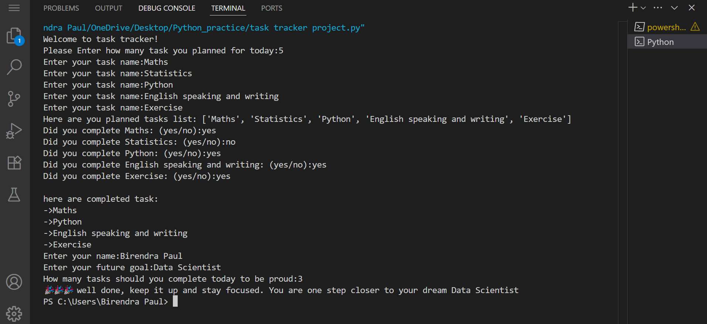

# 1️⃣ First Python Project - Task Tracker 

This is my **first ever Python project** – a simple **daily task tracker** built using basic Python concepts like:

- Variables
- Loops (`for`)
- Conditional statements (`if`)
- Lists
- User input and output

------

## 🤔 What It Does

 The program helps you:
- Plan your daily tasks
- Track which tasks are completed
- Reflect on your goal based on how much you complete

---

## 📸 Output Screenshot

---

## 📁 Files

- `task tracker project.py` – The main Python code
- `my-python-project-output.png` – Screenshot of output
- `README.md` – This file!

---

## 👨‍💻 What I Learned

- How to write a working Python program from scratch
- Using `input()` and `if`/`else` to make decisions
- Storing data using `lists`
- Writing and pushing code to GitHub!

---

## 🙋 About Me

Hi, I'm **Birendra**, a student at **IIT Madras** Foundation program.  
I'm passionate about learning programming and becoming a **data scientist and entrepreneur**.

---

## 📢 Feel Free to Connect With Me!
If you liked this project, please ⭐ star it or [connect with me on LinkedIn](www.linkedin.com/in/birendra-paul-iit2024)

